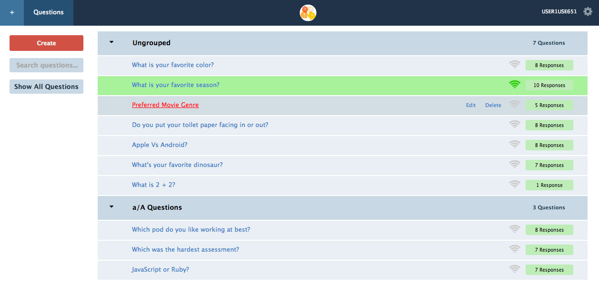
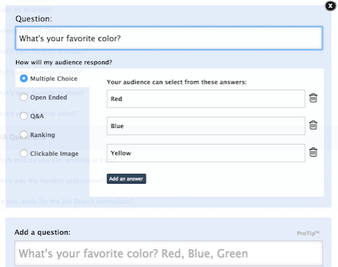
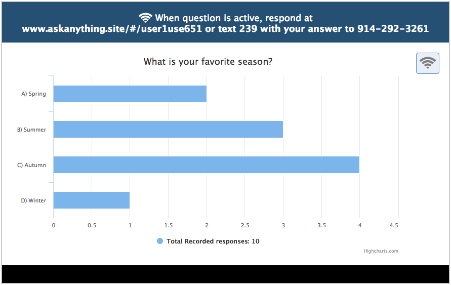
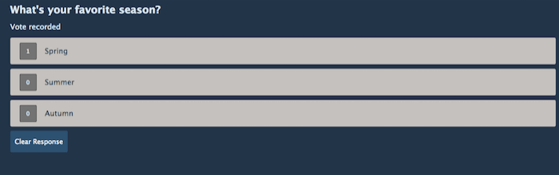

# Ask Anything!

[Ask Anything! live][heroku]

[heroku]: https://ask--anything.herokuapp.com/

Ask Anything! is a full-stack web application inspired by Poll Everywhere.  It utilizes Ruby on Rails on the backend, a PostgreSQL database, and React.JS with a Flux architectural framework on the frontend.  







## Features & Implementation


### Single-Page App

Ask Anything! is a single-page app; all content is delivered on one static page.  The root page listens to a `SessionStore` and renders content based on a call to `SessionStore.currentUser()`.  Sensitive information is kept out of the frontend of the app by making an API call to `SessionsController#show`.


### Question Rendering and Editing


  create_table "questions", force: :cascade do |t|
    t.string   "question",                   null: false
    t.integer  "survey_id",                  null: false
    t.datetime "created_at",                 null: false
    t.datetime "updated_at",                 null: false
    t.string   "category",                   null: false
    t.boolean  "active",


  On the database side, the questions are stored in one table in the database, which contains columns for `id`, `question`, `category`, `survey_id`, and `active`.  Upon login, an API call is made to the database which joins the user table and the the question table through `survey_id`.  These questions are held in the `QuestionStore` until the user's session is destroyed.  

  Questions are rendered in two different components: the `QuestionsIndex` component, which show the question and links to the `QuestionIndexItem` component show page.  In the component's show page, we can see the current status of the `question` as well as any responses that have been registered.  This page has links to Update and Delete the question as well as other features such as toggling a question to active - making it available for other users to register their response.  The `SurveysIndex` renders all of the `QuestionsIndex`s that belongs to it as subcomponents.  The UI of the taken directly from Poll Everywhere for a professional, clean look.

### Surveys

Implementing Surveys started with a survey table in the database.  The `Survey` table contains four columns: `id`, `title`, `ungrouped`, and `author_id`.  Additionally, a `survey_id` column was added to the `Question` table.  

The React component structure for surveys mirrored that of questions: the `SurveyIndex` component renders a list of `QuestionIndexItems`s as subcomponents. The front-end store, `SurveyStore` contains the data necessary for quick retrieval.  

`SurveyIndex` render method:

```javascript
render: function () {
  var surveys = "";

  if (this.surveysIsNotEmpty()) {
    surveys = this.mySurveys();
  }

  return (
    <div className="surveysindex-container group">
      <SideNav />
      <ul className="surveysindex-ul">
        { surveys }
      </ul>
    </div>
  );
}
```

### Answers

As with surveys, answers are stored in the database through an `Answer` table.  The `Answer` table contains the columns `id`, `answer`, and `question_id`.  The `Answer` table also acts as a join table for the `Question` table and `Response` table, which contains three columns: `id`, `answer_id`, and `user_id`.  

Answers are maintained on the frontend in the `QuestionFormStore`.  Because creating, editing, and destroying answers can potentially affect `Question` objects, the `QuestionsIndex` and the `QuestionIndexItem` both listen to the `QuestionFormStore`.

## Future Directions for the Project

In addition to the features already implemented, I plan to continue work on this project.  The next steps for Ask Anything! are outlined below.

### Draggable Edits

Enable draggable functionality with [dragula](https://bevacqua.github.io/dragula/) on question edit form to reorder answer choices quickly within the viewport.

### Question types

Add functionality for different question types such as open-ended questions, ranking questions, and clickable images.

### Speech Recognition

Add the [annyang](https://www.talater.com/annyang/) speech recognition library for responses to new question type: open-ended questions.
